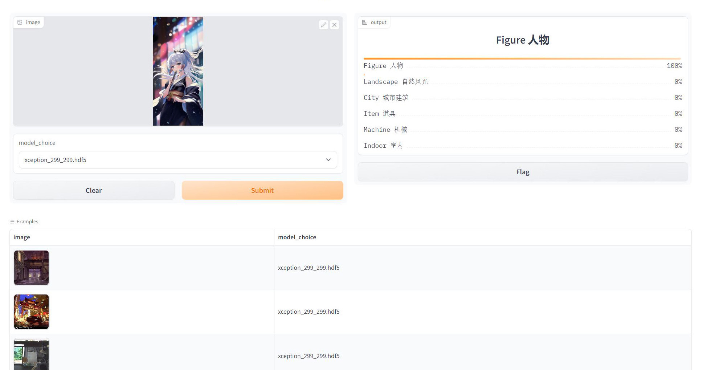

[![Contributors][contributors-shield]][contributors-url]
[![Forks][forks-shield]][forks-url]
[![Stargazers][stars-shield]][stars-url]
[![Issues][issues-shield]][issues-url]

  

  <h3 align="center">Anime Theme Classification</h3>
  

    Anime image theme classification webApp.
     
    <a href="https://huggingface.co/spaces/darkCat/Anime-image-classification"><strong>Play the model »</strong></a>
     
     
    <a href="https://github.com/dr413677671/Anime-image-classification/README.md">Explore the docs</a>
    ·
    <a href="https://github.com/dr413677671/Anime-image-classification/issues">Report Bug</a>
    ·
    <a href="https://github.com/dr413677671/Anime-image-classification/issues">Request Feature</a>
  

<!-- ABOUT THE PROJECT -->

## About this project

Anime theme classification.

One stage classification (home-trained) + combined background matting.

## Features:

- [x] Model
    - [x] Xception
    - [ ] SWIN2 (TBD)
- [x] Data Augmentation
    - [x] Random Crop
    - [x] Rescale
    - [x] Flip
    - [ ] Saturation
    - [ ] Contrast
    - [ ] Noise/Denoise
    - [ ] Mild rotate
    - [ ] Mask
- [ ] Hyperparameter Search
- [ ] Ensemble Learning
- [x] Others
    - [x] Early-stopping
    - [x] Finetune
    - [x] Optimizer-Adam
    - [x] Multi-labels classification
    - [ ] Class-weighting

(<a href="#readme-top">back to top</a>)

## Contact
 

 &nbsp;&nbsp;  &nbsp;&nbsp;  

## Acknowledgments

* [Xception](https://www.tensorflow.org/api_docs/python/tf/keras/applications/xception/Xception)
* [Background Matting](https://github.com/PeterL1n/BackgroundMattingV2#model--weights)
* [Background Segmentation](https://github.com/nikhilroxtomar/Remove-Photo-Background-using-TensorFlow)
* [Gradio](https://github.com/gradio-app/gradio)
* Logo genetrared by <a href="https://github.com/CompVis/stable-diffusion">Stable-Diffusion</a>

[contributors-shield]: https://img.shields.io/github/contributors/dr413677671/Anime-image-classification.svg?style=for-the-badge
[contributors-url]: https://github.com/dr413677671/Anime-image-classification/graphs/contributors
[forks-shield]: https://img.shields.io/github/forks/dr413677671/Anime-image-classification.svg?style=for-the-badge
[forks-url]: https://github.com/dr413677671/Anime-image-classification/network/members
[stars-shield]: https://img.shields.io/github/stars/dr413677671/Anime-image-classification.svg?style=for-the-badge
[stars-url]: https://github.com/dr413677671/Anime-image-classification/stargazers
[issues-shield]: https://img.shields.io/github/issues/dr413677671/Anime-image-classification.svg?style=for-the-badge
[issues-url]: https://github.com/dr413677671/Anime-image-classification/issues

